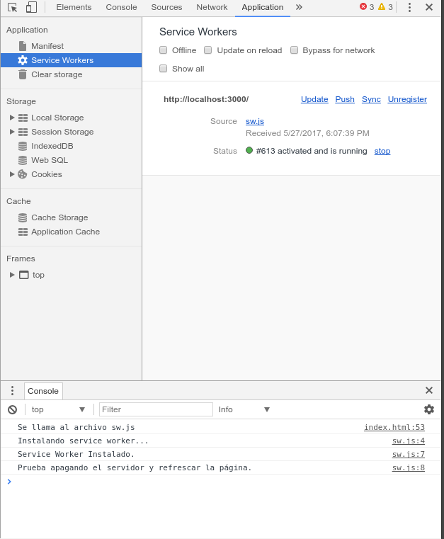

# Simple Service Worker

Este es un ejemplo básico de un _service worker_. La finalidad de este ejemplo es el instalar y guardar una página, con sus assets, para ser consultados en estado _offline_.

### Instalación
```bash
npm install
```

### Estructura de archivos
Una ves instalado el ejemplo, tendremos la siguiente estructura de archivos.
```
01_simple/
│̣__node_modules/
│__public/
|____assets/
|____images/
|____index.html
|____sw.js
|__package.json
|__server.js
```
### Uso
Para poder correr el ejemplo basta con el siguiente comando:
```bash
npm start
```
El servidor estará corriendo en el puerto _:3000_ de nuestro _localhost_.

### Funcionalidad
Al iniciar el servidor, expondrá la ruta _http://0.0.0.0:3000/index.html_.
Al abrir esta ruta, deberemos consultar la consola de nuestro navegador para ver si se ha instalado correctamente el **_service worker_** que se encuentra en el archivo _sw.js_.


Para estar seguros de que se instaló correctamente debemos ir, en la consola de comandos, a Applications -> Service Workers. Ahí podremos ver el _service worker_ instalado y su _status_ actual.




Vayamos a la terminal donde se encuentra corriendo el servidor y detengamos el proceso para simular la caida de un servidor, o si se prefiere, dentro de la consola del navegador podemos ir a _Network_ y marcar la casilla de _offline_ para tener el mismo resultado.

Una vez detenido el servidor o simulando que estamos _offline_ basta con actualizar la página para que el _service worker_ comience a funcionar y despache los recursos de la petición correspondiente.


Como resultado tendremos una serie de errores en la consola debido a que no encuentra los archivos, sin embargo, la página sguirá mostrando el contenido sin ningún problema, ya que al no encontrar el servidor _online_ se activa el _service worker_ como si fuera un _proxy_ y devuelte los recursos que se descargaron con anterioridad.

### Explicación
En sí, son muy sencillos los pasos en este ejemplo y en los siguientes son los mismo partiendo de lo siguiente:
#### Index.html
Este archivo es como cualquier otro, sólo que llama un archivo que contiene un _service worker_
``` html
 <script type="text/javascript">
        navigator.serviceWorker.register("./sw.js").then(function(){
        console.log("Se llama al archivo sw.js");
        });
      </script>
```
#### sw.js
Éste es el archivo que contiene el _service worker_ al cual se llama desde _index.html_.
Consta de dos funciones o eventos: **_install_** y **_fetch_**.
```javascript
self.addEventListener("install", function(event){ ... });
self.addEventListener("fetch", function(event){ ... });
```
En la primer función se instala se crea una problema con _waitUntil__ para abrir el caché que llamamos _simple_sw_ y dentro de este se guardarán los recursos que se definen en _addAll([ ... ])_.
```javascript
event.waitUntil(
    caches.open("simple_sw").then(function(cache){
      cache.addAll([
        "index.html"
        ...
       ])
   })
)
```

La función con el evento _fetch_ se encarga de servir las peticiones con lo que se encuentra en caché. El evento tiene la petición en _request_ y después devuelve la respuesta que coincida con lo que tiene guardado. En este caso llega una petición con la ruta _/index.html_ y devuelve el archivo junto con sus _assets_.

```javascript
event.respondWith(
    fetch(event.request).catch(function() {
      return caches.match(event.request);
    })
 )
```
