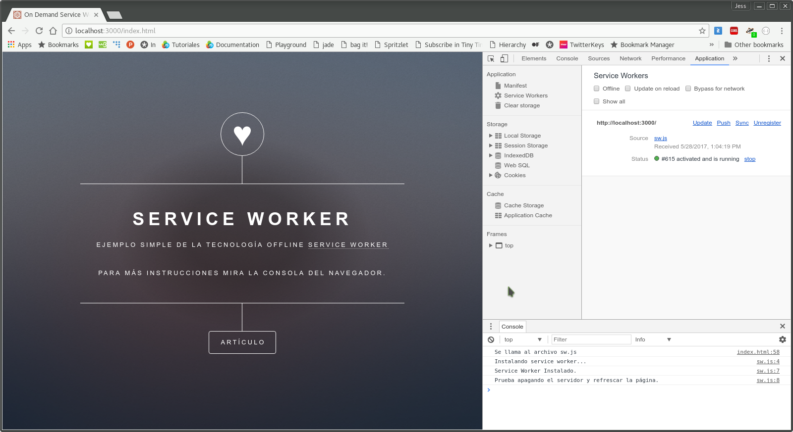
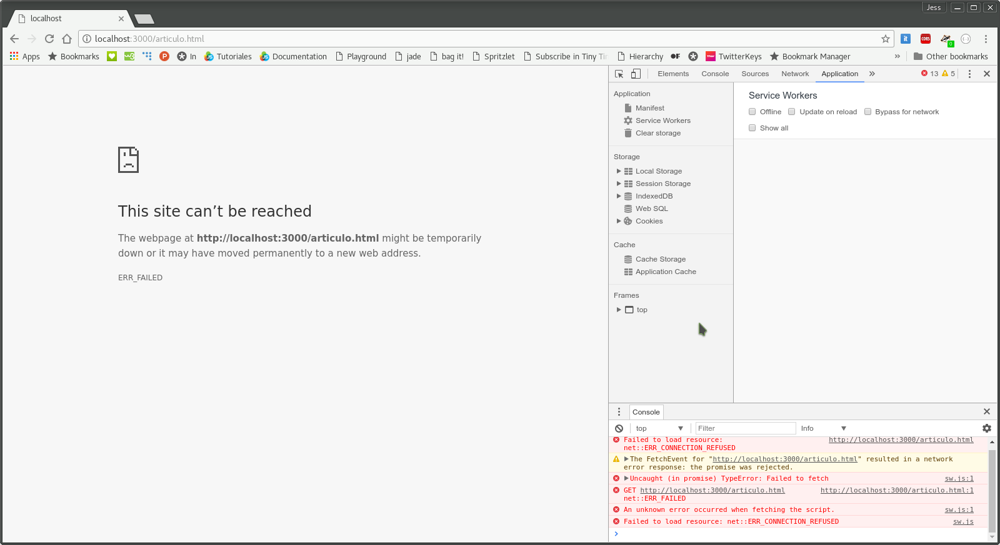
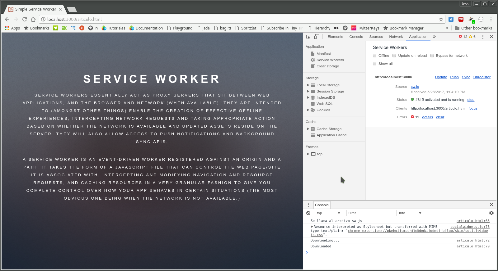
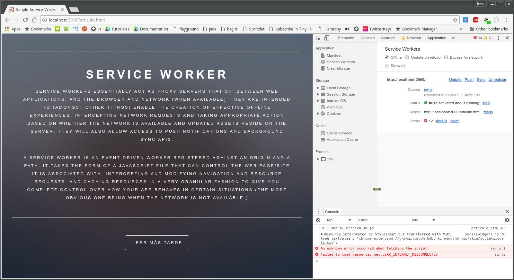

# On Demand - Service Worker

En este ejemplo es una demostración del potencial que ofrece la tecnología _service worker_ al poder almacenar recursos de forma dinámica y especificados por el usuario.

### Instalación
```bash
npm install
```

### Estructura de archivos
Una ves instalado el ejemplo, tendremos la siguiente estructura de archivos.
```
02_on_demand/
│̣__node_modules/
│__public/
|____assets/
|____images/
|____articulo.html
|____index.html
|____sw.js
|__package.json
|__server.js
```
### Uso
Para poder correr el ejemplo basta con el siguiente comando:
```bash
npm start
```
El servidor estará corriendo en el puerto _:3000_ de nuestro _localhost_.

### Funcionalidad
Al iniciar el servidor, expondrá la ruta _http://0.0.0.0:3000/index.html_.
Si seguimos el ejemplo [Simple Service Worker](../01_simple/), esta página y la instalación del _service worker_ es exáctamente la misma, sin embargo, ahora en el sitio, tenemos un _link_ hacia otra página llamada _Artículo_.



La página correspondiente a la ruta _/articulo.html_ no se encuentra especificada en el _service worker_ por lo que podemos intentar terminar el proceso del servidor o marcando la casilla _offline_ en la consola de nuestro navegador para darnos cuenta de que la ruta _/index.html_ se carga correctamente, pero al visitar _/articulo.html_ no ocurre lo mismo.



Volviendo a activar el servidor o regresando a línea desde la consola de nuestro navegador tenemos que actualizar la página _/articulo.html_ para poder desplegarla correctamente.
Podemos observar que esta página tiene un botón de _Leer más tarde_, lo que activará la funcionalidad del _service worker_ instalado para descargar la página actual para ser consumida de forma _offline_.



Al hacerlo, en la consola de nuestro navegador, imprimirá un mensaje de descarga. Sólo falta ponernos fuera línea para cargar la página sin necesidad de una red.



### Explicación
En sí el funcionamiento de este _service worker_ es exáctamente el mismo que del ejemplo anterior, sin embargo, en el archivo _/articulo.html_ tiene un evento en el _click_ del botón _leer más tarde_ que manda la petición de guardar el archivo en el caché que se especificó en el _service worker_.
#### articulo.html
Este archivo es como cualquier otro, sólo que llama un archivo que contiene un _service worker_
``` html
  <script>
   document.querySelector('.article').addEventListener('click', function(event) {
      event.preventDefault();
      var btn = document.querySelector('.article');
    caches.open('demand_sw').then(function(cache) {
        cache.addAll(["articulo.html"]);
    });
  });
</script>
```