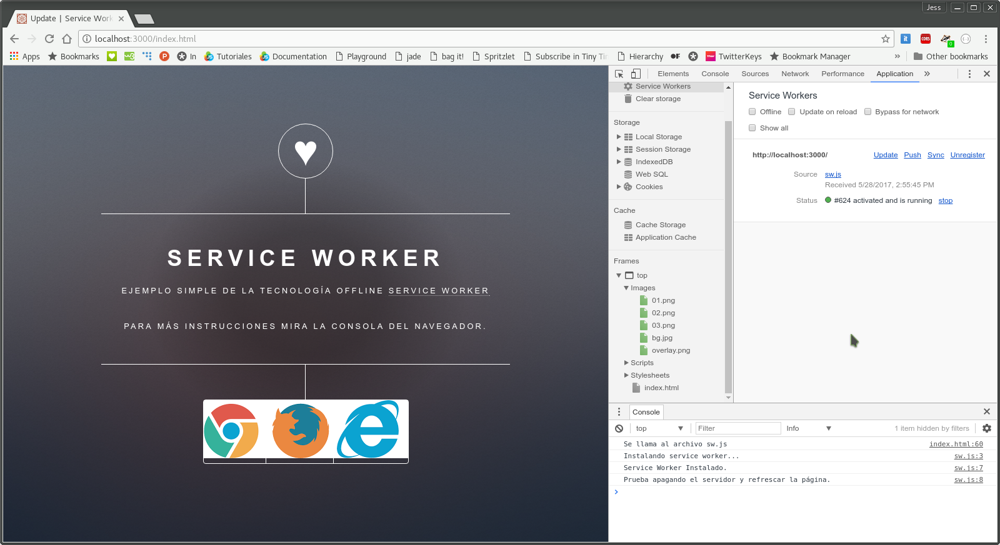
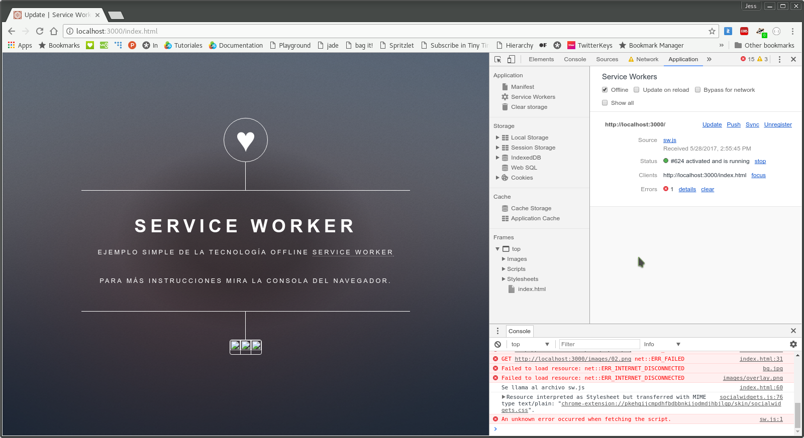
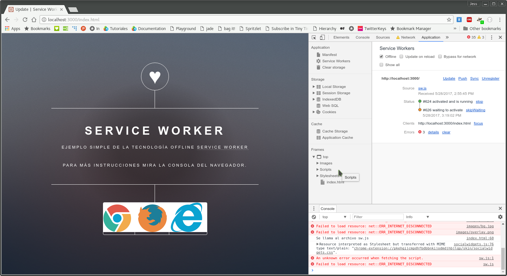
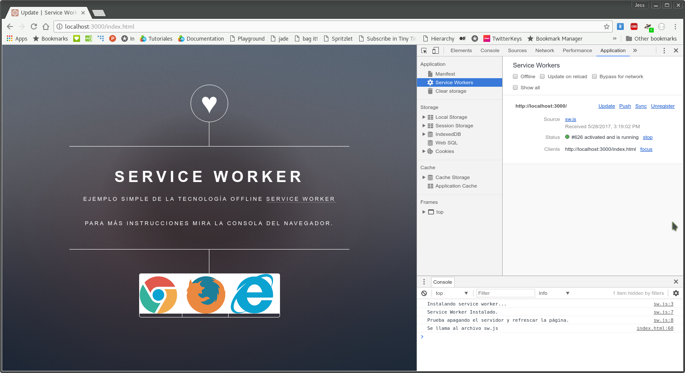

# Update - Service Worker

Este ejemplo se enfoca en la actualización de un _service worker_ pensando en la situación en la que un sitio requiera modificaciones y se necesiten descargar nuevos _assets_ o secciones para su correcto consumo _offline_.

### Instalación
```bash
npm install
```

### Estructura de archivos
Una ves instalado el ejemplo, tendremos la siguiente estructura de archivos.
```
03_update/
│̣__node_modules/
│__public/
|____assets/
|____images/
|____index.html
|____sw.js
|__package.json
|__server.js
```
### Uso
Para poder correr el ejemplo basta con el siguiente comando:
```bash
npm start
```
El servidor estará corriendo en el puerto _:3000_ de nuestro _localhost_.

### Funcionalidad
Al iniciar el servidor, expondrá la ruta _http://0.0.0.0:3000/index.html_.
En esta página tenemos algo parecido a los otros ejemplos, pero con algunas imágenes extra. Al abrir la página el _service worker_ se instalará y descargará los recursos que se especificaron. 



Intencionalmente se han dejado fuera del caché las imágenes de los navegadores, para después agregarlas en una actualización del _service worker_. Si activamos el modo _offline_ podremos ver que la página carga sin las imágenes.



Para poder actualizar el _service worker_ con las imágenes que nos faltó agregar en un principio tenemos que editar el archivo **_sw.js_**. Descomentemos las líneas que se encuentran comentadas y comentemos la línea _5_ como se muestra a continuación.

```javascript
  //caches.open("update_sw").then(function(cache){
  caches.open("update_sw_2").then(function(cache){ ... });
  ...
   return cache.addAll([
     ...
     "images/01.png",
     "images/02.png",
     "images/03.png"
   ]);
  
```
Después tenemos que iniciar el servidor nuevamente y actualizar la página para que nuestro _service worker_ se de cuenta de la nueva versión del caché y descargue los recursos nuevos.
Para verificar que todo salió correctamente, tenemos que activar el modo _offline_ y actualizar de nuevo la página.
 Ahora cargará el sitio correctamente.




Si vemos más a detalle, en la sección _Application -> Service Workers_ podemos notar que el _status_ se encuentra como _waiting to activate_ esto es debido a que cuando el _service worker_ encuentra una nueva versión no la activa, sino que la deja pendiente hasta que no haya ninguna página abierta que se encuentre usando la versión anterior. Para que se active la nueva versión debemos cerrar la ventana o pestaña y volver a abrirla.



### Explicación
En el archivo **_sw.js_** se declara el nombre del caché en el cual se alojarán los recursos, así como la lista de lo que se requiere guardar.

```javascript
caches.open("update_sw").then(function(cache){ ... });
```

Cuando se actualiza la lista, debemos indicar al _service worker_ otra versión para la nueva lista de recursos.

```javascript
caches.open("update_sw_2").then(function(cache){ ... });
```

Es muy fácil darse cuenta que no es más que pasar un nuevo nombre de caché para que la actualización se realice, si embargo, la versión anterior sigue alojada en el navegador, es por esto que es importante eliminar versiones que ya no se usen. Para saber cómo poder eliminar las versiones anteriores consultar el ejemplo: [04_delete](../04_delete/).