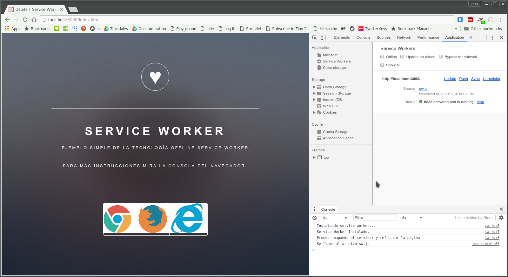
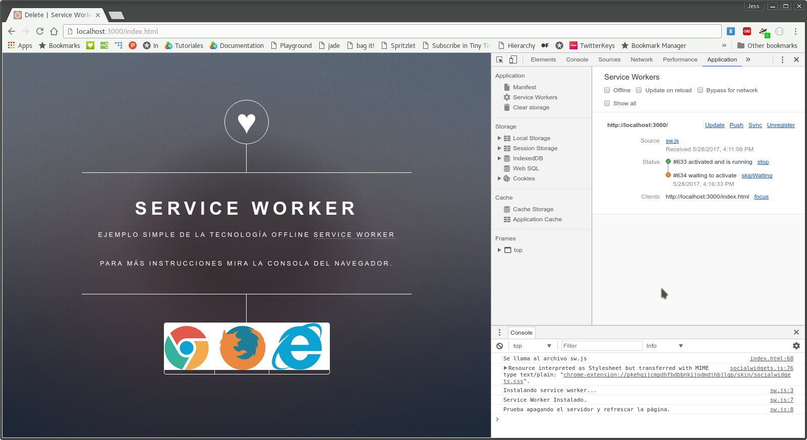

# Delete - Service Worker

En el ejemplo anterior, [Update - Service Worker](../03_update) podemos observar que vamos generando archivos de caché que ya no será utilizados. Una buena práctica es el eiliminar estos archivos que ya no serán necesarios.

### Instalación
```bash
npm install
```

### Estructura de archivos
Una ves instalado el ejemplo, tendremos la siguiente estructura de archivos.
```
04_delete/
│̣__node_modules/
│__public/
|____assets/
|____images/
|____index.html
|____sw.js
|__package.json
|__server.js
```
### Uso
Para poder correr el ejemplo basta con el siguiente comando:
```bash
npm start
```
El servidor estará corriendo en el puerto _:3000_ de nuestro _localhost_.

### Funcionalidad
Para este ejemplo seguiremos los pasos del anterior. Para instalar el _service worker_ debemos consultar la ruta _http://localhost:3000/index.html_. 



Debemos editar el archivo **_sw.js_** para generar la siguiente versión del caché y así tener uno que ya no se utilice para poder eliminarlo. Descomentemos las líneas que se encuentran comentadas y comentemos la línea _5_ como se muestra a continuación.

```javascript
  //caches.open("delete_sw").then(function(cache){
  caches.open("delete_sw_2").then(function(cache){ ... });
  ...
   return cache.addAll([
     ...
     "images/01.png",
     "images/02.png",
     "images/03.png"
   ]);
  
```

Una buena práctica es el eliminar las versiones anteriores de nuestro caché en el momento en que la nueva versión se activa. Así que debemos descomentar la función _activate_.

```javascript
this.addEventListener('activate', function(event) { ... });
```

Es momento de actualizar la página para ver nuestros cambios aplicados.



Nuevamente tenemos que cerrar la ventana o pestaña donde se encuentra el sitio para que el _service worker_ active el evento _activate_.


En la consola de nuestro navegadores veremos el mensaje _Deleting..._ que nos confirma la eliminación de las versiones anteriores.

### Explicación
En el archivo **_sw.js_** se declara en el evento _activate_ una variable con el nombre de la versión actual, para después poder eliminar cualquier otra versión que no corresponda con ese nombre.

```javascript
this.addEventListener('activate', function(event) {
  var cacheWhitelist = ['delete_sw_2'];
  event.waitUntil(
    caches.keys().then(function(keyList) {
      return Promise.all(keyList.map(function(key) {
        if (cacheWhitelist.indexOf(key) === -1) {
          return caches.delete(key);
        }
      }));
    })
  );
});
```