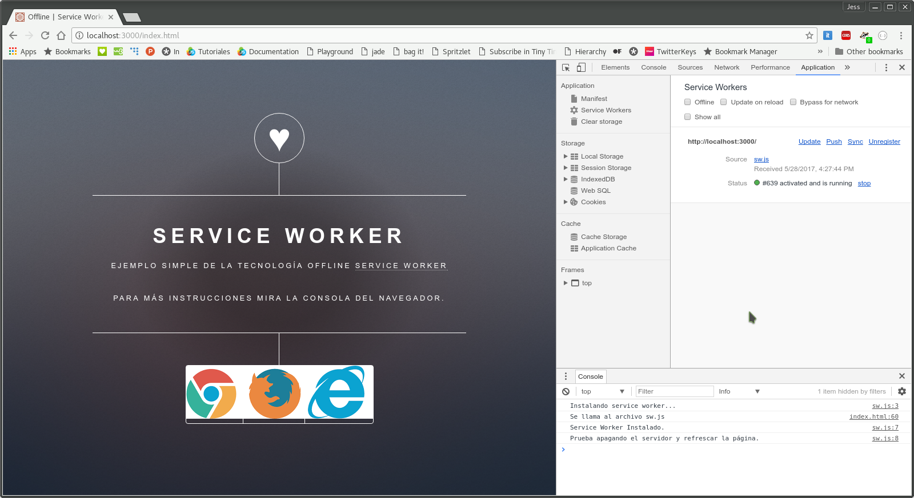
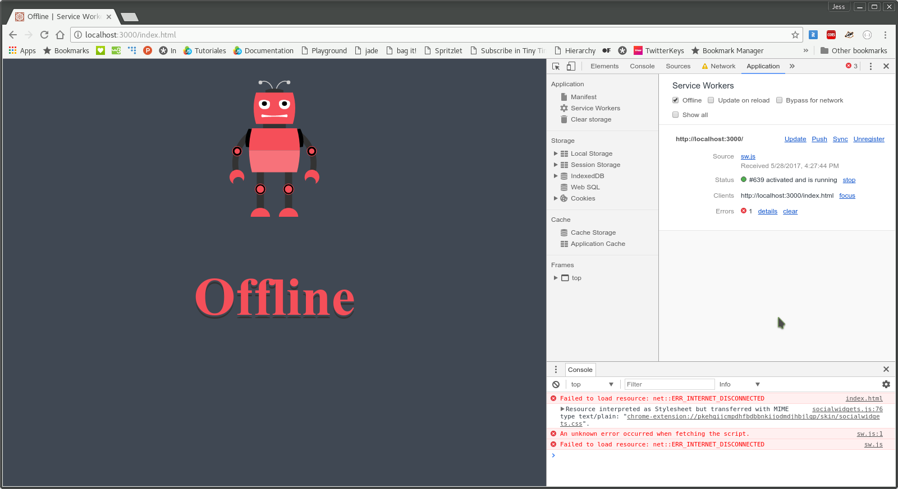

# Offline - Service Worker

Existen ocasiones en que no todas las funcionalidades o secciones de un sitio se pueden descargar o usar en modo _offline_ en este caso se requiere notificar al usuario que se encuentra sin conexión y que debe esperar a estar en línea. En este ejemplo veremos cómo devolver una respuesta al usuario cuando se encuentra _offline_.

### Instalación
```bash
npm install
```

### Estructura de archivos
Una ves instalado el ejemplo, tendremos la siguiente estructura de archivos.
```
05_offline/
│̣__node_modules/
│__public/
|____assets/
|____images/
|____index.html
|____offline.html
|____sw.js
|__package.json
|__server.js
```
### Uso
Para poder correr el ejemplo basta con el siguiente comando:
```bash
npm start
```
El servidor estará corriendo en el puerto _:3000_ de nuestro _localhost_.

### Funcionalidad
Para instalar el _service worker_ debemos consultar la ruta _http://localhost:3000/index.html_. 



Para mostrar la respuesta de que el usuario se encuentra fuera de línea, sólo basta con activar el modo _offline_ o detener el proceso donde se encuentra corriendo el servidor.



### Explicación
En  la instalación del _service worker_ especificamos que se almacene la página a mostrar cuando el usuario se enceuntre _offline_

```javascript
return cache.addAll([
        "offline.html"
 ])
```

En el evento _fetch_ del archivo **_sw.js_** vamos a modificar la respuesta como si de un servidor se tratara y hacer que por cada petición que se realice en modo _offline_ devuelva la página _offline.html_.

```javascript
...
return cache.match(request).then(function (matching) {
   return cache.match('offline.html');
});
```