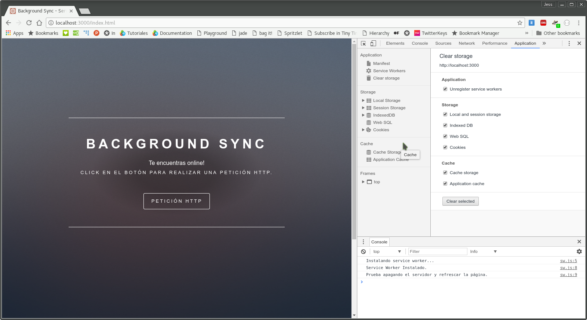
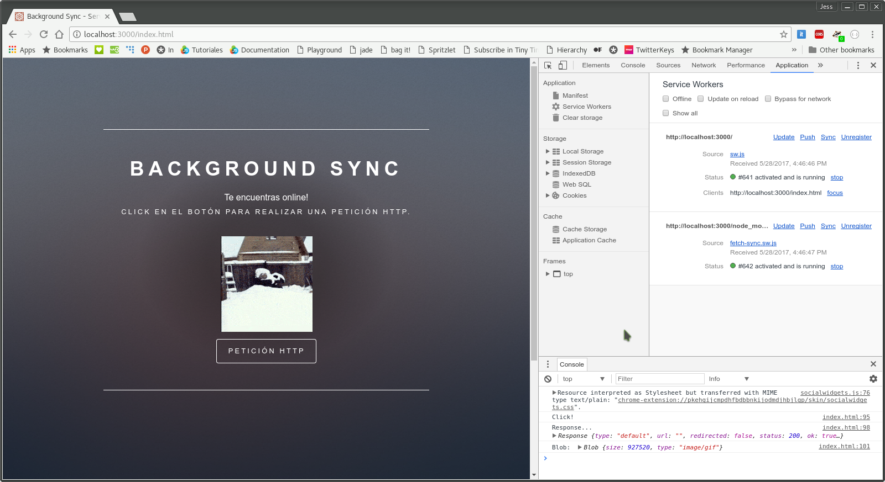
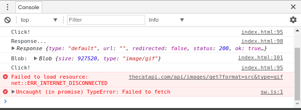
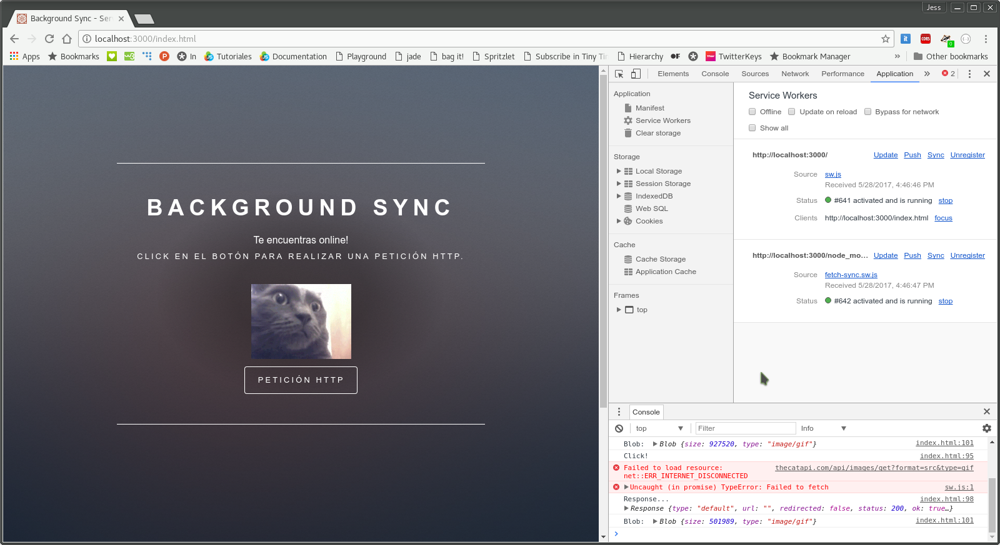

# Background Sync - Service Worker

Este ejemplo mostrará cómo guardar peticiones realizadas por el usuario cuando se enceuntra _offline_ y devolver una respuesta en cuanto vuelva a estar en línea.

### Instalación
```bash
npm install
```

### Estructura de archivos
Una ves instalado el ejemplo, tendremos la siguiente estructura de archivos.
```
06_background_sync/
│̣__node_modules/
│__public/
|____assets/
|____images/
|____index.html
|____sw.js
|__package.json
|__server.js
```
### Uso
Para poder correr el ejemplo basta con el siguiente comando:
```bash
npm start
```
El servidor estará corriendo en el puerto _:3000_ de nuestro _localhost_.

### Funcionalidad
Para instalar el _service worker_ debemos consultar la ruta _http://localhost:3000/index.html_. 



Para que se active nuestro _Service Worker_ debemos actualizar el sitio y después hacer una petición para saber cómo es una respuesta estando en modo _online_.



En la consola de nuestro navegador podremos ver el detalle de la petición. Al hacer _click_ en el botón pedimos una imagen aleatoria a un servidor externo.

Ahora falta detener nuestro servidor o activar el modo _offline_ y volver a solicitar otra imagen. _(Si es necesario, debemos desconectar nuestro internet, al tratarse de una llamada externa)_



Como vemos en la consola, hemos dado click y nos arroja un error debido a que no nos encontramos en línea. **Sin actualizar la página** volvamos al modo _online_. Es importante señalar que **no debemos actualizar** la página, ya que de esto se trata el ejemplo. Dependiendo de nuestro navegador, el _service worker_ buscará intermitentemente el regreso de la conexión y procesará la petición realizada. _(En mi caso tarda 5 minutos en buscar nuevamente la conexión)_



Como se esperaba, la petición fue resuelta después algunos minutos. La imagen ha cambiado exitosamente y en la consola se puede comprobar el detalle de la nueva petición.

### Explicación
En el archivo **_index.html_** se encuentra toda la lógica del ejemplo. Se declara un evento en el _click_ del botón _petición HTTP_.

```javascript
document.getElementById('requestButton').addEventListener('click', () => {
   fetchSync(getImage)
     .then(function(response){
       return response.blob();
      }).then(function(blob){
        result.src = URL.createObjectURL(blob)
        return true;
      }).catch(function(err){ })
});
```

En este evento se declara otro evento: _fetchSync_ de la librería que usamos _fetch_sync_, la cual toma las peticiones y las apila en el fondo con ayuda del _service worker_. Al ser una promesa, se queda en espera hasta que sea resuelta. Una vez encontrada una conexión y haber traido la nueva imágen, se reanuda el proceso normal pasando la ruta de la nueva imagen al _markup_ de la página.